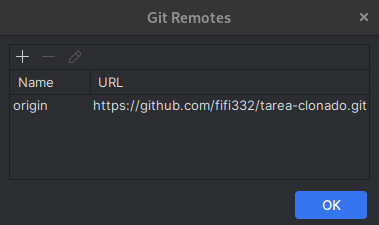
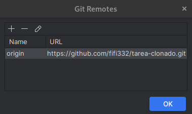
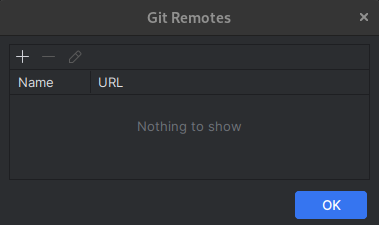
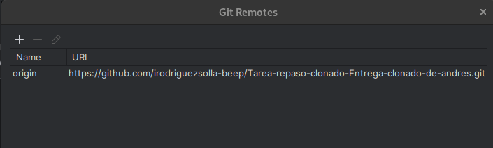

Clonar el Repositorio del Compañero:

Clonar el repositorio en el directorio de proyectos y acceder a él.

git clone URL_repositorio_del_compañero,

cd nombre_repositorio

¿Cómo se hace desde el PyCharm?
1. Abre PyCharm.
2. En la pantalla de bienvenida, haz clic en "Get from VCS" (o "Get from Version Control" según la versión).
3. En el campo URL, pega la URL del repositorio de tu compañero.

4. Elige la carpeta donde quieres guardar el proyecto.
5. Haz clic en "Clone".
6. PyCharm abrirá automáticamente el proyecto clonado.

-----------------------------------------------------------------------------
Configurar el Usuario Local:

Configurar el propio nombre de usuario y correo electrónico de Git para este repositorio local.
git config user.name "Tu Nombre",

git config user.email "tu.email@ejemplo.com",

¿Cómo se hace desde el PyCharm?

1. Abre la terminal dentro de PyCharm: View → Tool Windows → Terminal.
2. Ejecuta los comandos de Git exactamente como lo harías en cualquier terminal:
    + git config --global user.name "Tu Nombre"
    + git config --global user.email "tu.email@ejemplo.com"

-------------------------------------------------------
Ver Repositorios Remotos Actuales:

Comprobar que solo aparece el remoto que se acaba de clonar, denominado origin.

git remote -v

¿Cómo se hace desde el PyCharm?

1. Ve a VCS → Git → ManRemotes

----------------------------------------------------
Añadir el Repositorio como Nuevo Remoto:

Añadir el repositorio personal, pero asignarle un nombre diferente (ej. mirepositorio) para evitar conflictos.
1. Ve a VCS → Git → ManRemotes

2. En la ventana de Git Remotes, haz clic en el botón +
    + Name: Ponle un nombre al remoto
    + +URL: Pega la URL de tu nuevo repositorio
3. Haz clic en OK o Save.

----------------------------------------------------------------
Eliminar el Remoto Original:

Una vez añadido el propio remoto, eliminar el repositorio original (origin) para asegurar que solo se empuje al repositorio personal.
1. Ve a VCS → Git → ManRemotes

2. Selecciona el remoto que quieres eliminar

3. Haz clic en el botón -

---------------------------------------------------------
Ver Repositorios Remotos Finales:

Comprobar que origin ha desaparecido y solo queda mirepositorio.
1. Abre PyCharm y asegúrate de que tu proyecto tenga Git habilitado.
2. Busca la barra de herramientas de Git en la parte inferior derecha de PyCharm.
3. Haz clic en el nombre del branch → Manage Remotes o busca un ícono de “repositorio” o “Git” → Remotes.
4. Se abrirá una ventana donde puedes ver todos los remotos configurados, incluyendo su nombre y URL.
